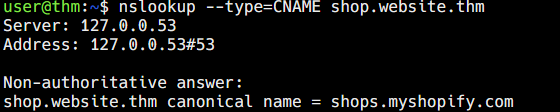

# CNAME Records

A CNAME (Canonical Name) record points one domain name to another ("canonical") domain name, rather than directly to an IP address.

## Looking Up a CNAME Record

```bash
nslookup --type=CNAME shop.website.thm
```



## Example Output

| Field | Value |
|---|---|
| Server | `127.0.0.53` |
| Address | `127.0.0.53#53` |
| Query | `shop.website.thm` |
| Canonical name | `shops.myshopify.com` |

This tells us `shop.website.thm` is actually an alias pointing to `shops.myshopify.com`.
