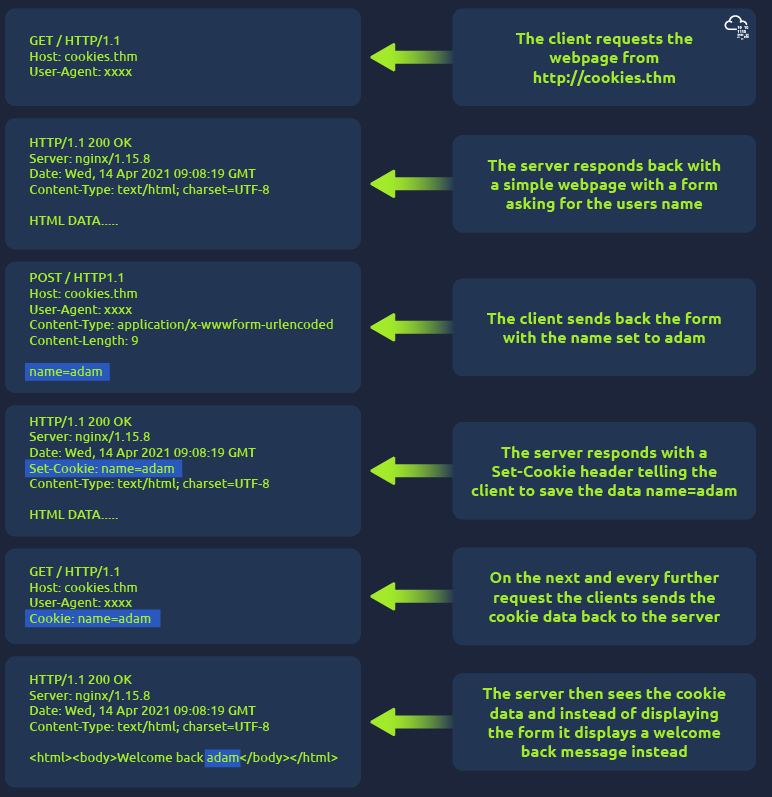

# How Cookies Work (Request/Response Flow)

| Step | Request/Response | What Happens |
|---|---|---|
| 1 | `GET / HTTP/1.1` to `cookies.thm` | The client requests the webpage from `http://cookies.thm`. |
| 2 | `HTTP/1.1 200 OK` | The server responds with a simple webpage containing a form asking for the user's name. |
| 3 | `POST / HTTP/1.1` with `name=adam` | The client sends back the form with the name set to `adam`. |
| 4 | `HTTP/1.1 200 OK` + `Set-Cookie: name=adam` | The server responds with a `Set-Cookie` header, telling the client to save the data `name=adam`. |
| 5 | `GET / HTTP/1.1` + `Cookie: name=adam` | On the next and every further request, the client sends the cookie data back to the server. |
| 6 | `HTTP/1.1 200 OK` | The server sees the cookie data and, instead of displaying the form, shows a "Welcome back adam" message instead. |
