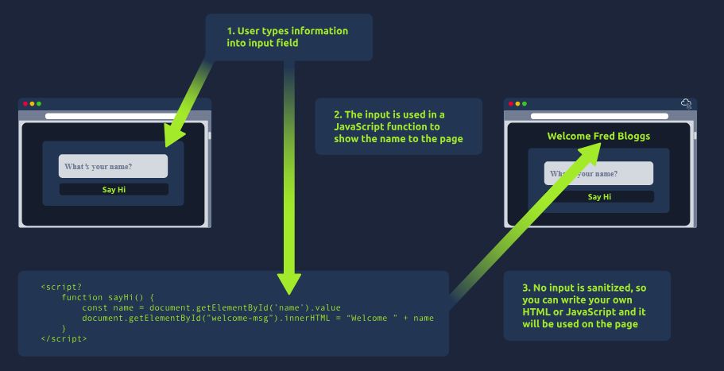

# HTML Injection Payloads

## How It Works

If user input is placed directly into a page without sanitisation, you can inject your own HTML/JavaScript, which the browser will then render or execute.



1. User types information into an input field.
2. The input is used in a JavaScript function to show the name on the page.
3. Because no input is sanitised, you can write your own HTML or JavaScript, and it will be used on the page.

## Payloads

### Inject a Link

```html
<a href="url">link text</a>
```
