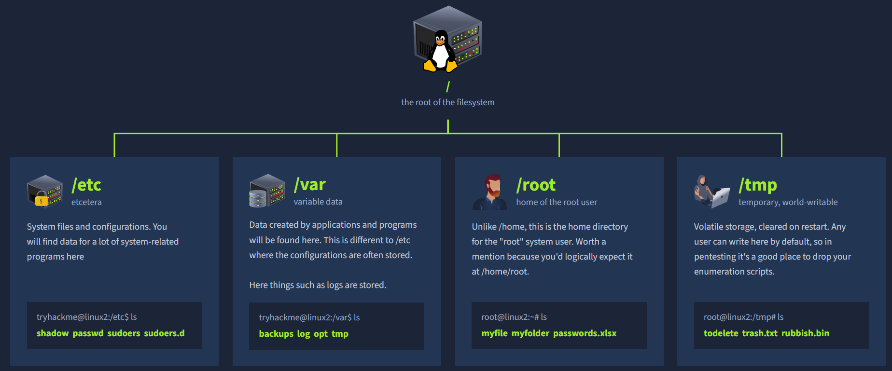

# Linux Root Directory Structure



Everything on a Linux system branches from `/`, the root of the filesystem.

| Directory | Name | Description |
|---|---|---|
| `/etc` | etcetera | System files and configurations. You will find data for a lot of system-related programs here. |
| `/var` | variable data | Data created by applications and programs will be found here — different to `/etc`, where configurations are often stored. Things such as logs are stored here. |
| `/root` | home of the root user | Unlike `/home`, this is the home directory for the "root" system user. Worth a mention because you'd logically expect it at `/home/root`. |
| `/tmp` | temporary, world-writable | Volatile storage, cleared on restart. Any user can write here by default, so in pentesting it's a good place to drop your enumeration scripts. |

## Example Listings

```
tryhackme@linux2:/etc$ ls
shadow  passwd  sudoers  sudoers.d

tryhackme@linux2:/var$ ls
backups  log  opt  tmp

root@linux2:~# ls
myfile  myfolder  passwords.xlsx

root@linux2:/tmp# ls
todelete  trash.txt  rubbish.bin
```
