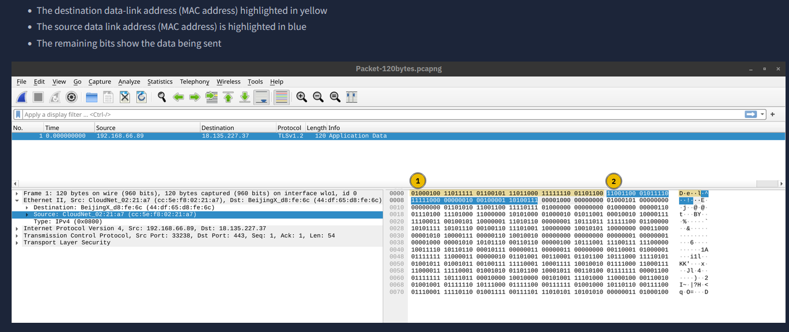
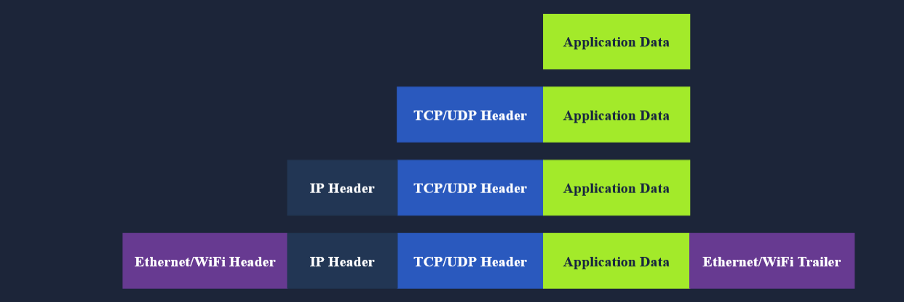
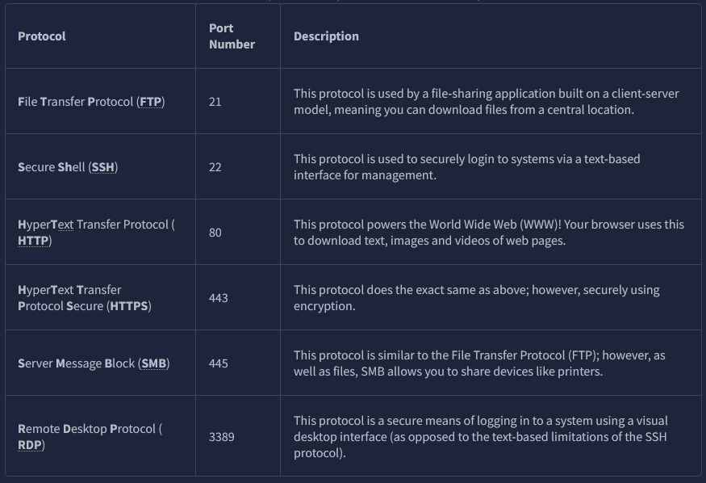

# OSI Model (Open Systems Interconnection)

The OSI Model splits network communication into 7 layers, each handling a different part of getting data from one device to another.

**Mnemonic:** **P**lease **D**o **N**ot **T**ouch **S**omebody's **P**urple **A**pe

| # | Layer |
|---|---|
| 1 | Physical Layer |
| 2 | Data Link Layer |
| 3 | Network Layer |
| 4 | Transport Layer |
| 5 | Session Layer |
| 6 | Presentation Layer |
| 7 | Application Layer |

## Layer Summary Table

| Layer | Name | Function | Examples |
|---|---|---|---|
| Layer 7 | Application layer | Providing services and interfaces to applications | HTTP, FTP, DNS, POP3, SMTP, IMAP |
| Layer 6 | Presentation layer | Data encoding, encryption, and compression | Unicode, MIME, JPEG, PNG, MPEG |
| Layer 5 | Session layer | Establishing, maintaining, and synchronising sessions | NFS, RPC |
| Layer 4 | Transport layer | End-to-end communication and data segmentation | UDP, TCP |
| Layer 3 | Network layer | Logical addressing and routing between networks | IP, ICMP, IPSec |
| Layer 2 | Data link layer | Reliable data transfer between adjacent nodes | Ethernet (802.3), WiFi (802.11) |
| Layer 1 | Physical layer | Physical data transmission media | Electrical, optical, and wireless signals |

---

## Layer 1 — Physical Layer

Contains the physical connection between devices (cables, radio signals, electrical/optical/wireless signals).

## Layer 2 — Data Link Layer

Contains the protocol to enable data transfer between adjacent nodes, e.g. Ethernet (802.3) and WiFi (802.11).

### MAC Addresses

The first half of a MAC address (the OUI — Organisationally Unique Identifier) identifies the manufacturer of the network interface:

| MAC Prefix | Vendor |
|---|---|
| `a4:c3:f0` | Intel |
| `85:ac:2d` | Network interface |

## Layer 3 — Network Layer

Sends the data between two nodes, using logical (IP) addressing and routing.

## Layer 4 — Transport Layer

Enables end-to-end communication, e.g. Transmission Control Protocol (TCP) and User Datagram Protocol (UDP).

## Layer 5 — Session Layer

Establishes and maintains communication, e.g. Network File System (NFS) and Remote Procedure Call (RPC).

## Layer 6 — Presentation Layer

Ensures data is delivered in an understandable format (encoding, encryption, compression).

## Layer 7 — Application Layer

Serves the network directly to end-user applications, e.g. Hypertext Transfer Protocol (HTTP).
